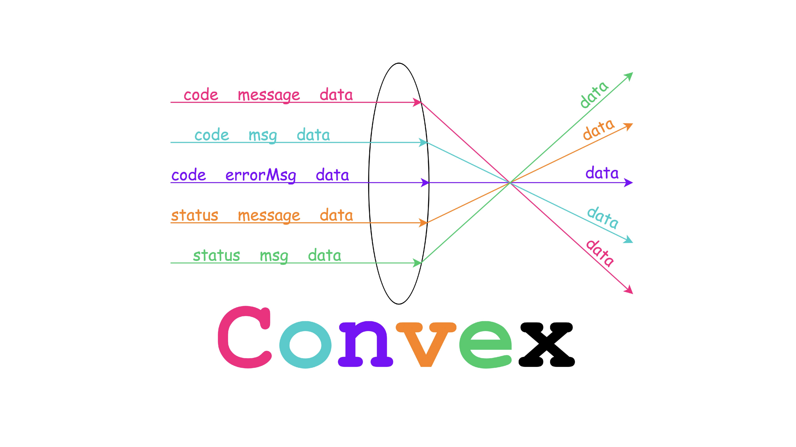

# Override
Convex is an elegant tool based on [Retrofit](https://github.com/square/retrofit)
to help developers just focus on business data.

# Background
Lots of Restful APIs' responses are designed following :

```json
{
	"code" : 0,
	"message" : "",
	"data" : {}
}
```

or

```json
{
	"status" : 0,
	"message" : "",
	"data" : {}
}
```

and so on.

So when developers use **Retrofit**, they have to design a **BaseResponse**
following :

```kotlin
data class BaseResponse<T>(
	@SerializedName("code")
	val code : Int = 0,
	@SerializedName("message")
	val message : String?,
	@SerializedName("data")
	val data : T?
)
```

And when define a service method they need to wrap business data with
**BaseReponse** following :

```kotlin
interface XXXService {
	@GET("xxx")
	suspend fun xxx() : BaseResponse<XXX>
}
```

# Thoughts

Handing **BaseResponse** is really boring and repetitive.😖

Is there a way to just handle **BaseResponse** only once?🤔

Is there a way to remove the business data wraper **BaseResponse**?🤔

So **Convex** comes out.🎉 🎉 🎉

# How to use

For more details, please see the [ConvexTest](https://github.com/ParadiseHell/convex/blob/main/convex/src/test/kotlin/org/paradisehell/convex/ConvexTest.kt).

### Grab Convex from Maven Central

In your build.gradle :

```gradle
dependencies {
    implementation "org.paradisehell.convex:convex:0.0.2"
}
```

### Implement a ConvexTansformer

```kotlin
private class XXXConvexTransformer : ConvexTransformer {
	@Throws(IOException::class)
	override fun transform(original: InputStream): InputStream {
		TODO("Return the business data InputStream.")
	}
}
```

### Register ConvexTransformer

```kotlin
Convex.registerConvexTransformer(XXXConvexTransformer())
```

### Add ConvexConverterFactory to Retrofit

```kotlin
Retrofit.Builder()
	.baseUrl("https://xxx.com/")
	// add ConvexConverterFactory first !!!
	.addConverterFactory(ConvexConverterFactory())
	.addConverterFactory(GsonConverterFactory.create())
	.build()
```

### Define service method with Transformer annotation

```kotlin
interface XXXService {
	// No BaseReponse is needed
	@GET("xxx")
	@Transformer(XXXConvexTransformer::class)
	suspend fun xxx() : XXX
}
```

**That's All, enjoy Convex.**

License
=======

    Copyright 2021 ParadiseHell.

    Licensed under the Apache License, Version 2.0 (the "License");
    you may not use this file except in compliance with the License.
    You may obtain a copy of the License at

       http://www.apache.org/licenses/LICENSE-2.0

    Unless required by applicable law or agreed to in writing, software
    distributed under the License is distributed on an "AS IS" BASIS,
    WITHOUT WARRANTIES OR CONDITIONS OF ANY KIND, either express or implied.
    See the License for the specific language governing permissions and
    limitations under the License.
